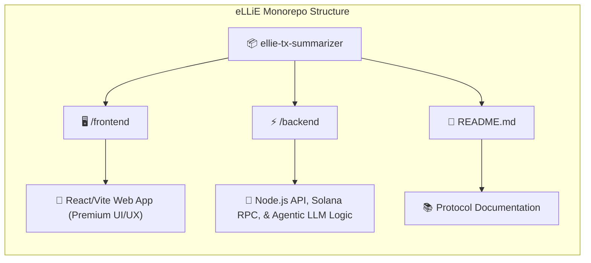

<div align="center">
    
  <br />
  
  <br /><br />
</div>

<p><b>**An active AI interpreter that replaces complex blockchain explorers by translating raw Solana transactions into plain-English intelligence.**

<div align="center">


</div>

---

## 🌐 The Problem & Solution

Legacy Solana block explorers (Solscan, Helius) are built for machines and developers. They output raw data dumps full of hex codes, compute units, and nested inner-instructions, creating massive friction for everyday users, auditors, and compliance teams.

**eLLiE** solves this through Agentic Intelligence. Rather than passively displaying raw JSON, eLLiE acts as an active interpreter. It fetches parsed transaction hashes via Solana RPCs and uses an LLM pipeline to autonomously synthesize the data into instant, human-readable intelligence (e.g., *"Wallet A swapped 500 USDC for 3.2 SOL on Jupiter"*).

---

## 🏗️ Monorepo Architecture

This project is structured as a monolithic repository (monorepo) to cleanly separate the client-facing UI from the agentic backend logic.


---

## 🚀 Features

* **Zero-Friction UI:** Institutional dark-mode design tailored for clarity and scannability.
* **Agentic Parsing:** Automatically decodes complex Solana program instructions and DeFi router hops.
* **Human-Readable Output:** Bypasses hex codes to deliver concise, tactical summaries.
* **Live Network Sync:** Real-time integration with Solana Mainnet-Beta.

---

## 🛠️ Quick Start

To run the eLLiE protocol locally, you will need to start both the backend API and the frontend client.

### 1. Backend Setup
```
cd backend
npm install
```
## 🔑 Create a .env file in the /backend directory and add your required API keys:
```
OPENAI_API_KEY=your_openai_key_here

SOLANA_RPC_URL=your_rpc_url_here

PORT=3001
```
## ⚡ Start the backend server:
```
npm run dev
```
## 2. Frontend Setup

Open a new terminal window:
```
cd frontend
npm install
```

## 🖥️ Start the frontend development server:
```
npm run dev
```

## 🛡️ Roadmap
Phase 1: Superteam Agentic Engineering MVP (Natural Language Translation).

Phase 2: Webacy API Integration (Wallet Risk Assessment & Smart Contract Threat Detection).

---

<div align="center">
  
  
© 2026 eLLiE Agentic Protocols. EVMG Technologies. All rights reserved.

Powered by Solana Mainnet-Beta  |  Supported by Superteam
